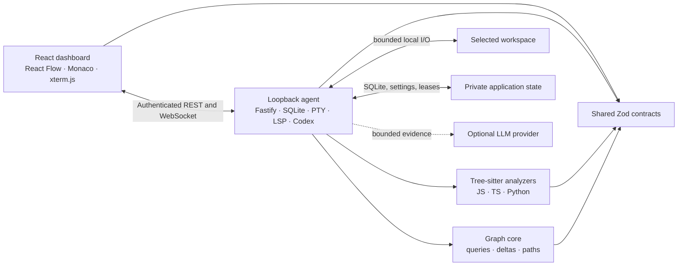

# Constelix

Constelix is a local-first visual software engineering workspace. It turns a
JavaScript, TypeScript, or Python repository into a live semantic graph with
code, terminals, project context, language intelligence, and AI in one
persistent dashboard.

Its primary workflow is progressive and map-first: **Explore** relationships,
open verified **Code**, **Ask** with local or generated evidence, and only then
**Act** through an explicitly approved turn. Help, onboarding, capability
status, and settings explain what is available before the user commits to an
operation.

## Requirements

- macOS.
- Node.js 24.
- pnpm 11.
- Codex CLI 0.144.5 for **Act** mode.
- An optional OpenAI-compatible endpoint for generated **Ask** responses. The
  default remote endpoint requires a key; loopback endpoints such as Ollama do
  not.

Without an available provider, **Ask Local** performs an offline structural
search over symbols, paths, signatures, snippets, and graph relations.

## Architecture

Constelix is a strict TypeScript and ESM pnpm monorepo:



- `apps/web/` contains the dashboard, canvas, editor, terminal, workspace
  selector, settings, and client-side state.
- `apps/agent/` contains the CLI, local server, indexer, persistence, file and
  path controls, PTY, Ask, Codex, LSP, workspace lifecycle, and browser API.
- `packages/contracts/` is the protocol boundary shared by browser and agent.
- `packages/analyzers/` extracts the semantic model with Tree-sitter.
- `packages/graph-core/` owns graph integrity, pagination, queries, paths, and
  revision deltas.
- `tests/e2e/` exercises the connected product in Chromium; `scripts/` contains
  packaging, version checks, smokes, and performance budgets.

## Development

```bash
git clone https://github.com/EdilsonDeveloper135/constelix.git
cd constelix
pnpm install --frozen-lockfile
pnpm dev -- /absolute/path/to/a/project
```

The shorter `pnpm dev /absolute/path/to/a/project` form is also supported. The
install and development entry points fail early with an actionable message when
Node.js is older than 24, avoiding opaque native-module ABI errors later.

The development dashboard runs at `http://127.0.0.1:5173` and proxies the local
protocol to the agent at `http://127.0.0.1:4321`. A custom
`CONSTELIX_WEB_ORIGIN` must be an exact loopback HTTP origin; the CLI rejects
credentials, paths, query strings, fragments, and non-loopback hosts before a
capability can be launched.

The CLI canonicalizes an external folder, detects whether it is writable, and
opens it in **Modo Edición** or **Modo Lectura**. Force the safer mode with:

```bash
constelix --read-only /absolute/path/to/a/project
```

## Workspaces and language intelligence

Use the workspace identity in the top bar to open a recent project, enter an
absolute path, browse local folders, or invoke the native macOS folder picker.
Candidate activation is transactional: a failed switch leaves the current graph
and tools intact. Unsaved drafts require an explicit preserve or discard
decision, and an active Act task blocks the switch.

Monaco connects to language servers supervised by the active local runtime:

- `typescript-language-server` for TypeScript and JavaScript.
- Pyright for Python.

Diagnostics, hover, completion and autoimports, definition, references, and
cross-file navigation remain local. Each workspace session isolates late REST,
event, PTY, LSP, Ask, Codex, watcher, and SQLite traffic after a switch.

## LLM settings

Open **Settings** to select an OpenAI, Ollama, or compatible preset, test the
connection before saving, and configure:

- `LLM_BASE_URL`: `https://api.openai.com/v1` by default.
- `LLM_MODEL`: `gpt-4o` by default.
- `LLM_API_KEY`: write-only and required for remote endpoints; optional for
  `localhost`, `127.0.0.1`, and `::1`.

For Ollama, start its local daemon and use an endpoint such as
`http://localhost:11434/v1`. A key entered in the UI is stored outside the
repository and SQLite in a bounded private file with mode `0600`; it is never
returned to the browser or inherited by terminal, LSP, or Codex processes.

Development may instead use an ignored `.env.local`:

```dotenv
LLM_BASE_URL=https://api.openai.com/v1
LLM_MODEL=gpt-4o
LLM_API_KEY=
```

Legacy `OPENAI_API_KEY` and `CONSTELIX_OPENAI_MODEL` aliases remain supported
when the preferred variables are unset.

Settings also provides dark, light, and system themes plus a persistent text
scale. The workspace switches one primary tool at a time and collapses into a
bottom navigation on compact screens without horizontal page overflow.

## Quality gates

```bash
pnpm typecheck
pnpm test
pnpm build
pnpm test:e2e
pnpm benchmark
pnpm smoke:lsp
pnpm smoke:package
pnpm audit --prod
```

`pnpm check` combines version validation, type checking, Vitest, and the
production build. The repository has no separate formatter or lint script;
style consistency is checked with TypeScript and `git diff --check`.

The real Codex smoke is opt-in because it starts an approved local agent turn:

```bash
CONSTELIX_CODEX_SMOKE_APPROVED=1 pnpm smoke:codex
```

## Production CLI

```bash
pnpm build
pnpm --filter @constelix/agent pack
npm install --global ./apps/agent/constelix-agent-0.0.7.tgz
constelix /absolute/path/to/a/project
```

The production agent binds to a random loopback port, serves its bundled
dashboard, and opens an ephemeral capability in the URL fragment. The browser
removes that fragment immediately after bootstrap, and the token is never
written to stdout, Fastify logs, or source maps.

## Local-first security boundaries

- Every API operation requires the loopback capability; WebSocket upgrades also
  require exact `Origin` and `Host` validation.
- Workspace paths are canonicalized and contained. Reads use bounded
  descriptor-based I/O with no-follow checks, UTF-8 validation, and identity
  revalidation. Writes are atomic and use optimistic SHA-256 conflict checks.
- Production responses set a restrictive content security policy, framing,
  referrer, cache, MIME, opener, resource, and permissions controls.
- Act requires one explicit approval per turn and rejects permission expansion
  or writes outside the active workspace.
- Read-only workspaces block editor writes and Act, and run PTYs through a
  macOS filesystem-write-denying sandbox that fails closed when unavailable.
- Child-process environments use an allowlist that excludes credentials and
  approval tokens. SQL uses parameterized statements and private state lives
  under macOS Application Support, never in the opened repository.
- Indexing is bounded to 10,000 eligible files, 100,000 traversed entries,
  25,000 entries per directory, 2 MiB per source, and 2 MiB aggregate source by
  default. Omissions and truncation remain visible to the user.
- Editor files are limited to 2 MiB, private LLM configuration files to 32 KiB,
  and event transport applies connection and backpressure limits.

Constelix assumes a trusted local user, browser, repository, and OS account. It
does not claim to isolate mutually hostile processes running under the same
macOS user. See the [threat model](docs/threat-model.md),
[protocol](docs/protocol.md),
[v0.0.7 product and experience audit](docs/audit-v0.0.7.md),
[progressive shell ADR](docs/adr/0001-progressive-workspace-shell.md), and
[known limitations](KNOWN_ISSUES.md).

Version checkpoints follow [VERSIONING.md](VERSIONING.md).
